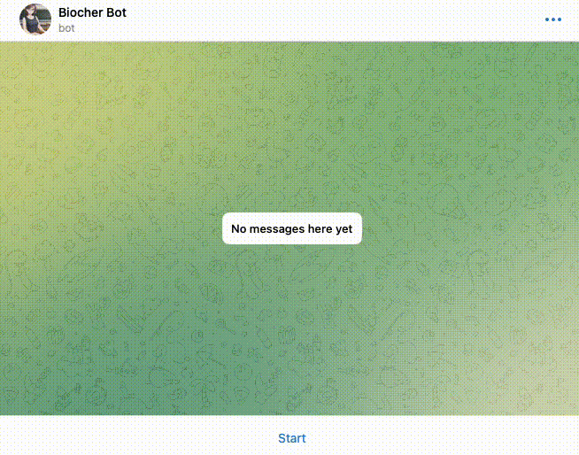

# 🧬 Biocher Bot 🧬

Biocher Bot is a Telegram chatbot designed to answer questions on A Level Biology. Chatbot responses to user questions are based on retrieval-augmented generation  against a predefined knowledge base, such as a collection of relevant textbooks.



## Preparing OpenAI and Telegram crendentials
First, make a copy of `.env-template` and rename it as `.env`.
```bash
cp .env-template .env
```
Add your [OpenAI API key](https://help.openai.com/en/articles/4936850-where-do-i-find-my-api-key) and [Telegram token](https://t.me/botfather) to `.env`.


## Installing dependencies
Biocher Bot uses [conda](https://docs.conda.io/projects/miniconda/en/latest/miniconda-install.html) to manage Python environments. To install the necessary dependencies, use the command:
```bash
conda env create -f biocher-bot.yml
```

Once all dependencies are installed, activate the newly-created environment using
```bash
conda activate biocher-bot.yml
```


## Preparing the knowledge base
Before using Biocher Bot, it is first necessary to populate the knowledge base with 
relevant reference texts such as textbooks, articles or research papers.

The references texts must be in PDF format. Place the PDFs in the `./data` directory (create the folder if it does not already exist).

Populate the knowledge base by running:
```bash
python -m src.vector_store
```


## Starting Biocher Bot
Finally, start the Telegram bot by running:
```bash
python -m src.bot
```

Happy learning!